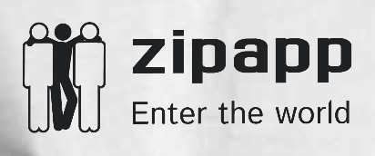

<p align="center">
  
</p>

  <p align="center">The Zipapp originals.</p>
    <p align="center">
<a href="https://circleci.com/gh/nestjs/nest" target="_blank"></a>
<a href="https://coveralls.io/github/nestjs/nest?branch=master" target="_blank"></a>
<a href="" target="_blank"></a>

</p>

## Description

Frontend application build with nextjs 13 appDir and Typescript

## Installation

```bash
$ nvm use

$ npm install
```

## Running the app

```bash
# development
$ npm run dev
```

Open [http://localhost:8080](http://localhost:8080) with your browser to see the result.

## Test

```bash
# unit tests
$ npm run test
```

## Stay in touch

- Author - [oevadee](https://github.com/oevadee)
- Website - [https://zipapp.com]()
- Twitter - [@zipapp]()

This project uses [`next/font`](https://nextjs.org/docs/basic-features/font-optimization) to automatically optimize and load Inter, a custom Google Font.

## Deploy on Vercel

The easiest way to deploy your Next.js app is to use the [Vercel Platform](https://vercel.com/new?utm_medium=default-template&filter=next.js&utm_source=create-next-app&utm_campaign=create-next-app-readme) from the creators of Next.js.

Check out our [Next.js deployment documentation](https://nextjs.org/docs/deployment) for more details.
